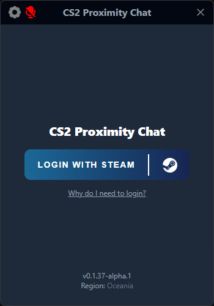
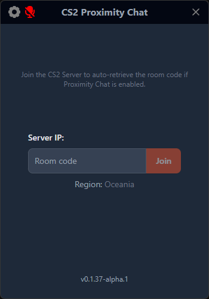
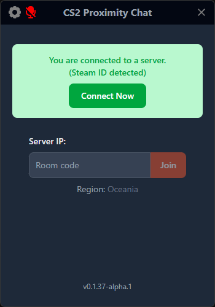
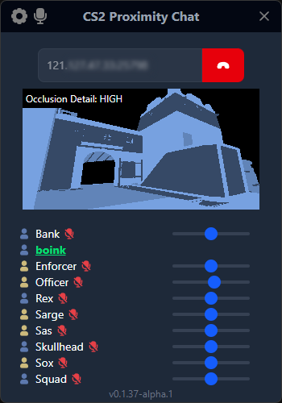
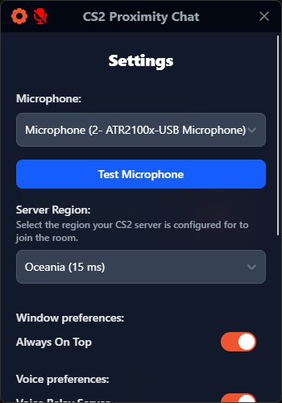
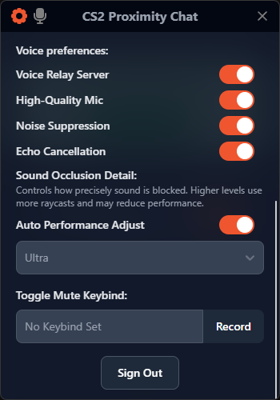
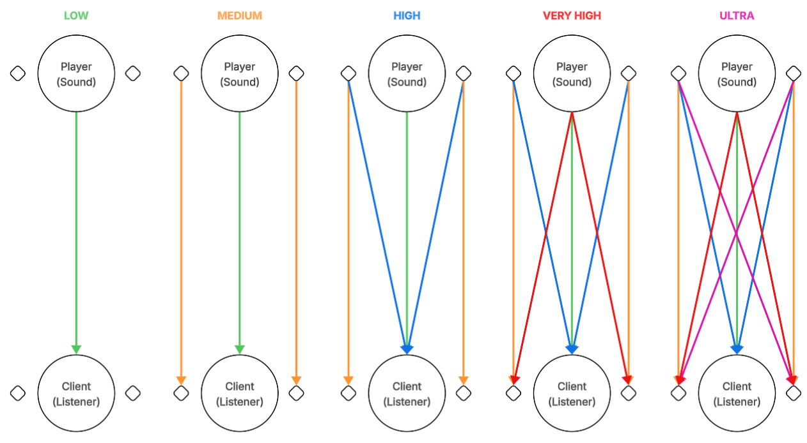

# CS2 Voice Proximity (Client)

Electron-based client for proximity voice chat in Counter-Strike 2, featuring 3D positional audio with server-side raycast occlusion using [Three.js](https://threejs.org).

## Links

- [Voice Chat Client](https://github.com/b0ink/CS2-VoiceProximity-Client)
- [CS2 Plugin](https://github.com/b0ink/CS2-VoiceProximity-Plugin)
- [API Server](https://github.com/b0ink/CS2-VoiceProximity-Server)

## Screenshots

<p align="center">
    
    
    
</p>
<p align="center">
    
    
    
</p>

## Installation

### Option 1: Use the pre-built installer

Download the installer setup from the [latest release](https://github.com/b0ink/CS2-VoiceProximity-Client/releases/latest)

### Option 2: Build from source

Clone the repo & install dependencies:

```bash
git clone https://github.com/b0ink/CS2-VoiceProximity-Client.git
cd CS2-VoiceProximity-Client
npm install
```

Build for Windows and generate a setup installer:

```bash
npm run build:win
```

Develop with UI hot reloading (`src/main` changes require restart):

```bash
npm run dev
```

Develop with multiple app instances (each requires a valid JWT; use `window.saveAuth(steamid, token)` in the console to set manually):

```bash
npm run dev:multi 2
```

## How it works

The [CS2 plugin](https://github.com/b0ink/CS2-VoiceProximity-Plugin) sends player position data and server-computed occlusion data to an API, which broadcasts listener-specific updates to connected clients in a voice room.

The client uses these updates to render positional audio and apply audio filtering in real time.

### Occlusion

Occlusion is calculated on the game server with raycasts between each listener and other players.

A listener-specific blocked-vs-clear ray fraction is sent to each client, which applies the value to low-pass filtering and distance falloff so players behind cover sound muffled.

Diagram of server-side raycast patterns by quality level:

<p align="center">
    
</p>

Concept inspired by [this video](https://www.youtube.com/watch?v=0W29lnDGD9E).

### Voice Relay Server

Voice data is relayed through a TURN server by default to protect user IPs. For lower latency, you can disable this in private rooms — P2P will only work if both you and the other player(s) disable relaying.

---

<p align="center">
    <sub>Project development started in April, 2025.</sub>
	<br>
	<br>
	<a href="https://www.paypal.com/donate/?hosted_button_id=ZRBPV5GAXAWWU" 
	target="_blank">
	
	</a>
</p>
